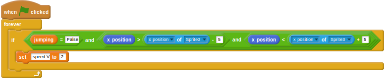

## Making the hurdles an obstacle

At the moment the runner can just plough straight through the hurdles. She needs to be slowed down if she doesn't jump.

- Back on the hurdler sprite, add in a new `when green flag clicked` block.
- This next part is a little complicated. The runner should be slowed down if she:
  1. Isn't jumping
  1. Has an x position just before the hurdle
  1. Has an x position just after the hurdle
- This can be achieved using two `and` logical operators, checking if:
  1. `jumping = False`
  1. `x position > x position of hurdle - 5`
  1. `x position < x position of hurdle + 5`
- If all those conditions are met, then she must have hit the hurdle and her speed can be dropped.

	<!--
	when green flag clicked
	forever
	if <<(jumping)=[False]>and<<(x position) > (([x position v] of [Sprite3 v])- [5])> and <(x position) < (([x position v] of [Sprite3 v]) + [5])>>>
	set [speed V] to [2]
	-->

	

