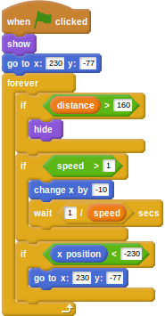
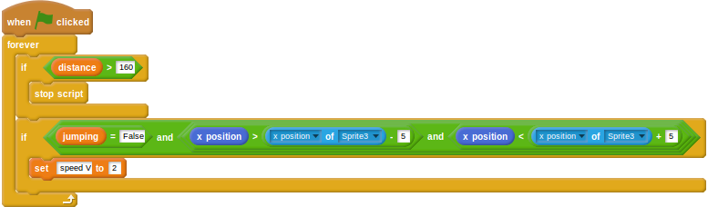

## Hiding the hurdles

You may have noticed that the hurdles stay on the screen, even when the player is approaching the finishing line. A little change to some of the scripts, and the game can be made more realistic.

- The first thing to do is to hide the hurdles when the `distance` variable climbs above a certain value. Click on the hurdles sprite you have imported and then alter the script to include a conditional to check for this. You'll also need to add in a `show` when the script is started.

    <!--
    ``` scratch
	when green flag clicked
	show
	go to x: [230] y:[-77]
	forever
	if <(distance) > [160]>
	hide
	if <(speed) > [1]>
	change x by [-10]
	wait <[1]/(speed)> secs
	if <(x position) < [-230]>
	go to x:[230] y:[-77]
    ```
    -->

	
	
- Next, the script that slows the player down when they hit the hurdles needs to be stopped at the same `distance`, so the player can't run into invisible hurdles. Click on the hurdler sprite and edit the collision script.

    <!--
	``` scratch
	when green flag clicked
	forever
	if <(distance) > [160]>
	stop script
	if <<(jumping)=[False]>and<<(x position) > (([x position v] of [Sprite3 v])- [5])> and <(x position) < (([x position v] of [Sprite3 v]) + [5])>>>
	set [speed V] to [2]
	```
    -->

	

- Have a play of the game and make sure that the hurdles disappear towards the end. You might need to tweak the variables a little to get the perfect result.

