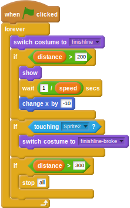

## Breaking the finish line

You may have noticed a second finish line graphic in the `items` directory, showing a broken finish line. You can use this in your game.

- Click on the finish line sprite and then click on the *Costumes* tab.
- Now click on *Import* and choose the `finishline-broke` graphic from the `items` folder in `assets`.
- Back on the *Scripts* tab, edit the script that makes the finish line appear. You're going to add a _conditional_ so that when the finish line is touched by the player, it breaks and the player continues running for a little while.

    <!--
	when green flag clicked
	forever
	switch costume to [finishline v]
	if <(dlstance) > [200]>
	show
	wait ([1]/(speed)) secs
	change x by [-10]
	end
	if <touching [Sprite2 v]?>
	switch costume to [finishline-broke v]
	end
	if <(distance) > [300]>
	stop [all]
    -->

	

