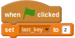
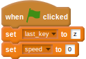
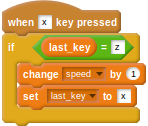

## Capturing the key mashing

- The first step is to capture the `x` and `z` key presses, and use the speed at which the player is pushing the keys to control the size of a variable. To do this you'll need a variable that stores the last known key press. Create a variable called `last_key` and set it to `z` when the green flag is clicked.

	

- For the next script you'll need a new variable called `speed`, so go ahead and create it now. It can be set to `0` when the game begins.

    <!--
	``` scratch
	when green flag clicked
	set [last_key v] to [z]
	set [speed v] to [0]
	```
    -->
	
	

- When the `x` key is pressed, if the `last_key` is equal to `z`, then the `speed` variable can be increased and the `last_key` can be set to `x`. This will ensure that the player can't cheat and keep hitting the `x` key to make the speed increase.

	

- The same can be done for the `z` key. In combination, these two scripts force the player to hit the keys _alternately_ in order to increase the speed variable.

	

- Now test your script. Click the green flag, then repeatedly press the `x` and `z` keys and watch the speed variable increase.

