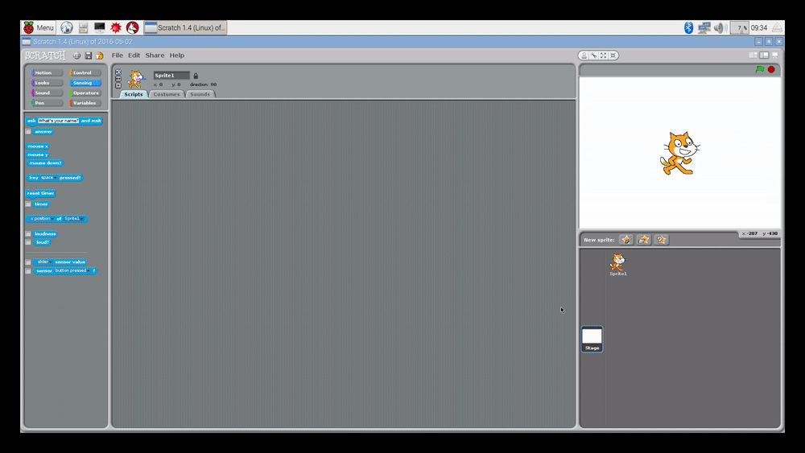

## Setting up the assets

- Open Scratch by clicking on `Menu` > `Programming` > `Scratch`.
- Now, click on the `background` icon and import the new background from the `assets` directory. You can then delete the old background.
- Click on the icon to import a new sprite and then choose the `run-1` image. Next, import `run-2`, `run-3`, and `run-4` as additional costumes. You can then delete the old cat sprite.

