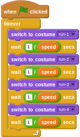

## Animating the hurdler

- At the moment, the hurdler has 4 costumes as part of what's called a _walk cycle_ (or run cycle in this case). When these costumes are switched, the character appears to run on the spot. The time delay between costume switches should depend on the `speed` variable. The higher the `speed`, the quicker the costume change should be and therefore the smaller the delay. You can get this effect by dividing `1` by the `speed` variable to calculate a delay.

	<!--
	``` scratch
	when green flag clicked
	forever
	switch costume to [run-1 v]
	wait ([1]/(speed)) secs
	switch costume to [run-2 v]
	wait ([1]/(speed)) secs
	switch costume to [run-3 v]
	wait ([1]/(speed)) secs
	switch costume to [run-4 v]
	wait ([1]/(speed)) secs
	```
	-->
	
	

- If you run this script as it is, you'll get an error, because `speed` starts off with a value of `0`. This means the computer is trying to calculate `1 / 0`, which it can't do. It's a very common error that programmers make in their code. To fix this, you can use a conditional to make sure that the calculation only occurs when `speed` is larger than `0`.

	<!--
	``` scratch
	when green flag clicked
	forever
	if <(speed) > [0]>
	switch to costume [run-1 v]
	wait ([1]/(speed)) secs
	switch to costume [run-2 v]
	wait ([1]/(speed)) secs
	switch to costume [run-3 v]
	wait ([1]/(speed)) secs
	switch to costume [run-4 v]
	wait ([1]/(speed)) secs
	```
	-->
	
	

- Now you should be able to test your script and watch the hurdler running on the spot as you press the `x` and `z` keys.

