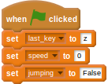
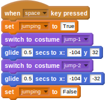

## Jumping

- Hurdlers need to jump. You'll need a few more costumes for this part, so look in the runner directory and import the `jump-1` and `jump-2` costumes for your hurdler.

- You'll need a new variable for this part called `jumping`. This is because other scripts will need to know when the character is jumping. Create the new variable and set it to `False`.

	<!--
	when green flag clicked
	set [last_key v] to [z]
	set [speed v] to [0]
	set [jumping v] to [False]
	-->
	
	
	
- The character should jump when the space bar is pressed. The first thing that happens is the `jumping` variable should be set to `True`, then the costume can be changed to `jump-1` and the character can glide upwards. Next, the costume can be changed to `jump-2` and the character can glide back down again. Finally, the `jumping` variable can be returned to `False` to indicate that the jumping animation has finished.

	<!--
	when [space v]key pressed
	set [jumping v] to [True]
	switch to costume [jump-1 v]
	glide [0.5] secs to x: [-104] y [32]
	switch to costume [jump-2 v]
	glide [0.5] secs to x: [-104] y [-32]
	set [jumping v] to [False]
	-->
	
	
	
- Test your script; it might surprise you to see that the character's costume doesn't change. This is because the walk cycle you set up previously is still working. You'll need to stop this walk cycle when the character is jumping. To do this, you can use an `and` conditional operator to check that both `speed > 0` and `jumping = False` for the walk cycle to work.

	<!--
	when green flag clicked
	forever
	if <<(speed) > [0]>and<(jumping) = [False]>>
	switch to costume [run-1 v]
	wait ([1]/(speed)) secs
	switch to costume [run-2 v]
	wait ([1]/(speed)) secs
	switch to costume [run-3 v]
	wait ([1]/(speed)) secs
	switch to costume [run-4 v]
	wait ([1]/(speed)) secs
	-->
	
	
	
- Now have a go and you should find your character jumps when the space key is pressed.

