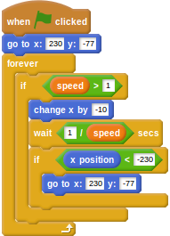

## Adding in hurdles

For the final part of this worksheet, you can add in hurdles that the character will have to jump over.

- Import the hurdle.png sprite from the `assets/items` directory.
- This sprite needs to begin at the far right of the screen, then it should continually move left across the screen at a pace that's proportional to the speed of the character. When it hits the far left of the screen, it should instantly appear on the right again.

	<!--
	when green flag clicked
	go to x: [230] y:[-77]
	forever
	if <(speed) > [1]>
	change x by [-10]
	wait <[1]/(speed)> secs
	if <(x position) < [-230]>
	go to x:[230] y:[-77]
	-->
	
	

