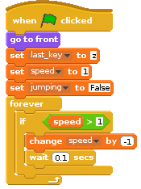

## Slowing down

- At the moment, the more you press the `x` and `z` keys, the faster the character runs. There needs to be a way of slowing the hurdler down, so she doesn't win too easily. This can be done on your initial script that sets the starting variables. You just need to add an infinite loop that will check if the speed is greater than 1, and then lower it every few 100ths of a second.

	<!--
	``` scratch
	when green flag clicked
	set [last_key v] to [z]
	set [speed v] to [0]
	set [jumping v] to [False]
	forever
	if <(speed) > [-1]>
	change [speed v] by [1]
	wait [0.5] secs
	```
	-->
	
	

