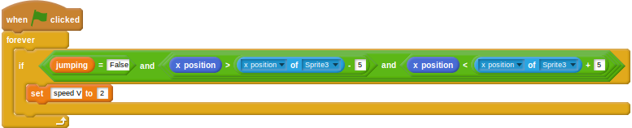

## बाधाओं को अवरोध बनाना

फिलहाल धावक बाधाओं में से सीधे निकल कर जा सकती है। अगर धावक कूदती नहीं है तो उसे धीमा करने की ज़रूरत है।

- धावक स्प्राइट पर वापस जाकर, एक नया `when green flag clicked` (जब हरे रंग के झंडे को क्लिक किया जाए) ब्लॉक जोड़ें।
- यह अगला हिस्सा थोड़ा जटिल है। धावक को धीमा कर दिया जाना चाहिए यदि वह: 
    1. कूद नहीं रही है
    2. बाधा से ठीक पहले x स्थिति है
    3. बाधा के ठीक बाद x स्थिति है
- इसे दो `and` (और) लॉजिकल ऑपरेटरों का उपयोग करके हासिल किया जा सकता है, यह जाँच करके कि: 
    1. `jumping = False`
    2. `x position > x position of hurdle - 5`
    3. `x position < x position of hurdle + 5`

- यदि ये सभी शर्तें पूरी होती हैं, तो उसने बाधा को हिट किया होगा और उसकी गति कम की जा सकती है।
    
    <!--
when green flag clicked
forever
if <<(jumping)=[False]>and<<(x position) > (([x position v] of [Sprite3 v])- [5])> and <(x position) < (([x position v] of [Sprite3 v]) + [5])>>>
set [speed V] to [2]
-->
    
    