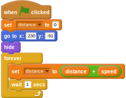
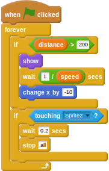

## गेम का अंत बनाना

- किसी पूरे किए गए गेम को समाप्त करने के लिए, आपको समाप्ति की एक पंक्ति को जोड़ना होगा। आपको यह `assets/items` (सामग्री/वस्तुएँ) निर्देशिका में मिल सकती है।
- इसे अपने Scratch गेम में एक नए स्प्राइट के रूप में आयात करें, और इसे लगभग धावक लेन में रखें।
- शुरू करने के लिए, आपको यह नियंत्रित करने के लिए एक वेरिएबल का उपयोग करने की आवश्यकता है कि धावक को कितनी दूर तक दौड़ना है। एक नया वेरिएबल बनाएँ और इसका नाम `distance` (दूरी) रखें।
- फिनिश लाइन में जोड़ी जाने वाली पहली स्क्रिप्ट गेम के शुरू होने पर `distance` (दूरी) को `0` पर सेट करेगी, फिनिश लाइन को स्क्रीन पर दूर दाईं ओर रखेगी, और इसे छुपा देगी। इसके बाद, `distance` (दूरी) को हर सेकंड धावक की `speed` (गति) से बढ़ाना होगा।
    
    <!--
when green flag clicked
set [distance v] to [0]
go to x: [230] y: [-91]
hide
forever
set [distance v] to ((distance) + (speed))
wait [1] secs
-->
    
    

- अब चूंकि फिनिश लाइन काम करने के लिए तैयार है, आप इसे `distance` (दूरी) के आपके द्वारा अपेक्षित किसी भी मान (नीचे दिए गए उदाहरण में 200) को हिट करने पर प्रकट कर सकते हैं। फिर यह स्क्रीन पर धावक की तरफ बढ़ने लग सकता है। जब धावक फिनिश लाइन को छूता/छूती है, तो सभी गेम स्क्रिप्ट समाप्त हो जानी चाहिए।
    
    <!--
when green flag clicked
forever
if <(distance) > [200]>
show
wait ([1]/(speed)) secs
change x by [-10]
end
if <touching [Sprite2 v]?>
wait [0.2] secs
stop [all]
-->
    
    