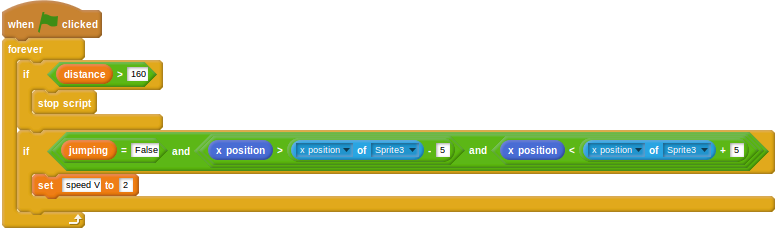

## बाधाएँ छुपाना

आपने देखा होगा कि बाधाएँ स्क्रीन पर रहती हैं, भले ही खिलाड़ी फिनिशिंग लाइन पर पहुँचने वाला/वाली हो। कुछ स्क्रिप्ट्स में थोड़ा सा बदलाव करके, गेम को और वास्तविक बनाया जा सकता है।

- पहली चीज़ यह करनी होती है कि जब `distance` (दूरी) वेरिएबल किसी निश्चित मान से ऊपर चला जाता है तो बाधाओं को छिपा दिया जाए। आपने जिस बाधा स्प्राइट को आयात किया है उस पर क्लिक करें और फिर स्क्रिप्ट में बदलाव करें ताकि इसकी जाँच करने के लिए एक शर्त को शामिल किया जाए। जब स्क्रिप्ट शुरू होती है तो आपको `show` (दिखाएँ) भी जोड़ना होगा।
    
    <!--
when green flag clicked
show
go to x: [230] y:[-77]
forever
if <(distance) > [160]>
hide
if <(speed) > [1]>
change x by [-10]
wait <[1]/(speed)> secs
if <(x position) < [-230]>
go to x:[230] y:[-77]
-->
    
    

- इसके बाद, जो स्क्रिप्ट खिलाड़ी के बाधाओं पर हिट करने पर उन्हें धीमा करती है उसे उसी `distance` (दूरी) पर रोकना होगा, ताकि खिलाड़ी अदृश्य बाधाओं में न दौड़ सके। धावक स्प्राइट पर क्लिक करें और टकराव स्क्रिप्ट को संपादित करें।
    
    <!--
when green flag clicked
forever
if <(distance) > [160]>
stop script
if <<(jumping)=[False]>and<<(x position) > (([x position v] of [Sprite3 v])- [5])> and <(x position) < (([x position v] of [Sprite3 v]) + [5])>>>
set [speed V] to [2]
-->
    
    

- गेम को चलाकर देखें और सुनिश्चित करें कि अंत में बाधाएँ गायब हो जाती हैं। सही परिणाम प्राप्त करने के लिए आपको वेरिएबल में थोड़ा सुधार करना पड़ सकता है।