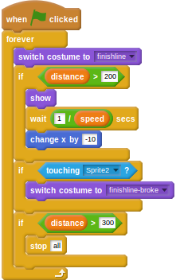

## फिनिश लाइन तोड़ना

आपको `items` (आइटम) निर्देशिका में शायद दूसरी फिनिश लाइन का ग्राफ़िक दिखाई दिया हो, जिसमें एक टूटी हुई फिनिश लाइन दिखाई देती है। आप इसे अपने गेम में इस्तेमाल कर सकते हैं।

- फिनिश लाइन स्प्राइट पर क्लिक करें और फिर *Costumes* (पोशाक) टैब पर क्लिक करें।
- अब *Import* (आयात) पर क्लिक करें और `assets` (सामग्री) में `items` (वस्तुएँ) फ़ोल्डर में से `finishline-broke` (फिनिशलाइनलाइन-टूटी) ग्राफिक चुनें।
- वापस *Scripts* (स्क्रिप्ट) टैब पर जाकर, उस स्क्रिप्ट को संपादित करें जिसकी वजह से फिनिश लाइन दिखाई देती है। आप एक *conditional* (शर्त) जोड़ने जा रहे हैं ताकि जब खिलाड़ी फिनिश लाइन को छुए, तो यह टूट जाए और खिलाड़ी थोड़ी देर तक चलता रहे।
    
    <!--
when green flag clicked
forever
switch costume to [finishline v]
if <(dlstance) > [200]>
show
wait ([1]/(speed)) secs
change x by [-10]
end
if <touching [Sprite2 v]?>
switch costume to [finishline-broke v]
end
if <(distance) > [300]>
stop [all]
-->
    
    