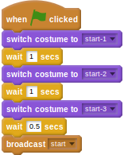
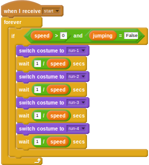

## आरंभ को सेट अप करना

`runner` (धावक) निर्देशिका में तीन ग्राफिक्स हैं जिनका आपने अभी तक उपयोग नहीं किया है। इनका नाम `start-1`, `start-2`, और `start-3` है। खिलाड़ी को शुरू करने के लिए, आप इनका उपयोग गेम के आरंभ में कर सकते हैं।

- धावक स्प्राइट पर क्लिक करें और फिर *Costumes* (पोशाक) पर।
- अब धावक के लिए तीन *starting* (शुरूआती) पोशाकें आयात करें।
- वापस *Scripts* (स्क्रिप्ट) टैब पर क्लिक करें।
- अब आप गेम शुरू करने के लिए एक नई स्क्रिप्ट जोड़ सकते हैं। जब `green flag` (हरा झंडा) पर क्लिक किया जाता है, तो प्रारंभिक पोशाकों को एनिमेट किया जा सकता है, इससे पहले कि स्क्रिप्ट `broadcasts` (प्रसारण) यह दर्शाना शुरू करे कि गेम शुरू हो सकती है।
    
    <!--
when green flag clicked
switch costume to [start-1 v]
wait [1] secs
switch costume to [start-2 v]
wait [1] secs
switch costume to [start-3 v]
wait [0.5] secs
broadcast [start v]
-->
    
    

- अब आपको मुख्य एनिमेशन लूप को संपादित करने की आवश्यकता है ताकि यह हरे रंग के झंडे पर क्लिक किए जाने के बजाय प्रसारण पर शुरू हो।
    
    <!--
when I receive [start v]
forever
if <<(speed) > [0]>and<(jumping) = [False]>>
switch to costume [run-1 v]
wait ([1]/(speed)) secs
switch to costume [run-2 v]
wait ([1]/(speed)) secs
switch to costume [run-3 v]
wait ([1]/(speed)) secs
switch to costume [run-4 v]
wait ([1]/(speed)) secs
-->

