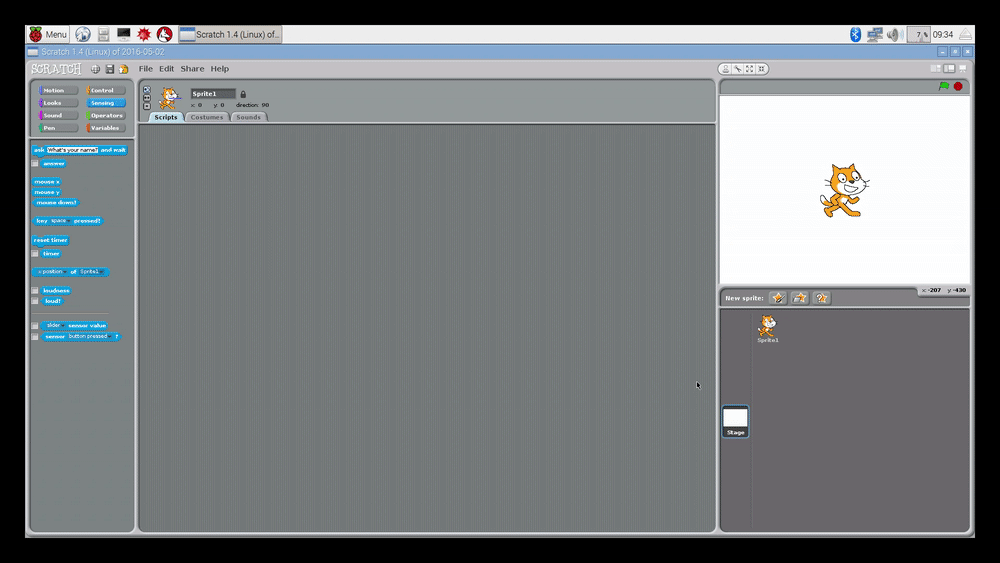

## सामग्री सेट अप करना

- `Menu` > `Programming` > `Scratch` पर क्लिक करके स्क्रैच को खोलें।
- अब, `background` (पृष्ठभूमि) आइकन पर क्लिक करें और `assets` (सामग्री) निर्देशिका से नई पृष्ठभूमि आयात करें। इसके बादआप पुरानी पृष्ठभूमि को हटा सकते हैं।
- नया स्प्राइट आयात करने के लिए आइकन पर क्लिक करें और फिर छवि `run-1` (चलाएँ-1) चुनें। इसके बाद, `run-2`, (चलाएँ-2) `run-3` (चलाएँ-3), और `run-4` (चलाएँ-4) को अतिरिक्त पोशाकों के रूप में चुनें। इसके बादआप पुराने कैट स्प्राइट को हटा सकते हैं।