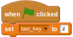

## Key mashing (कुंजी मैशिंग) को कैप्चर करना

- पहला कदम `x` और `z` को कैप्चर करना है, और उस गति का उपयोग करना है जिस गति पर खिलाड़ी किसी वेरिएबल के आकार को नियंत्रित करने के लिए कुंजियों को दबा रहा है। ऐसा करने के लिए आपको एक ऐसे वेरिएबल की ज़रूरत होगी जिसमें अंतिम ज्ञात कुंजी दबाए जाने को संगृहीत किया जाता है। `last_key` नामक एक वेरिएबल बनाएँ और इसे `z` पर सेट करें जब हरे झंडे को क्लिक किया जाता है।
    
    

- अगली स्क्रिप्ट के लिए आपको `speed` (गति) नामक एक नए वेरिएबल की ज़रूरत होगी, तो आगे बढ़ें और इसे अभी बनाएँ। इसे गेम के शुरू होने पर `0` पर सेट किया जा सकता है।  <!--
when green flag clicked
set [last_key v] to [z]
set [speed v] to [0]
-->

- जब `x` कुंजी को दबाया जाता है, तो यदि `last_key` (अंतिम कुंजी) `z` के बराबर हो, तो `speed` (गति) वेरिएबल को बढ़ाया जा सकता है और `last_key` (अंतिम कुंजी) को `x` पर सेट किया जा सकता है। इससे यह सुनिश्चित होगा कि खिलाड़ी धोखा नहीं दे सकता और गति को बढ़ाने के लिए `x` कुंजी को लगातार दबाना जारी नहीं रख सकता है।
    
    

- `z` कुंजी के लिए भी यही किया जा सकता है। संयोजन में, ये दोनों स्क्रिप्ट खिलाड़ी को गति वेरिएबल को बढ़ाने के लिए कुंजियों को *alternately* (एक के बाद एक) दबाने के लिए मजबूर करती हैं।
    
    

- अब अपनी स्क्रिप्ट का परीक्षण करें। हरे रंग के झंडे पर क्लिक करें, फिर `x` और `z` कुंजियों को बार-बार दबाएँ और गति वेरिएबल को बढ़ते हुए देखें।