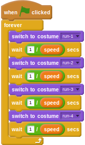
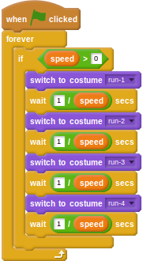

## धावक को एनिमेट करना

- फिलहाल, धावक के पास *चलने के चक्र* (या इस मामले में दौड़ के चक्र) नामक हिस्से के रूप में 4 पोशाकें हैं। जब इन पोशाकों को बदला जाता है, तो पात्र उसी समय दौड़ता हुआ दिखाई देता है। पोशाकों के बदले जाने के बीच समय का विलंब `speed` (गति) वेरिएबल पर निर्भर करेगा। `speed` (गति) जितनी अधिक होगी, पोशाक बदलना उतना ही शीघ्र होना चाहिए और इसलिए देरी कम होनी चाहिए। देरी की गणना करने के लिए आप इस प्रभाव को `1` को `speed` (गति) वेरिएबल से विभाजित करके प्राप्त कर सकते हैं।
    
    <!--
when green flag clicked
forever
switch costume to [run-1 v]
wait ([1]/(speed)) secs
switch costume to [run-2 v]
wait ([1]/(speed)) secs
switch costume to [run-3 v]
wait ([1]/(speed)) secs
switch costume to [run-4 v]
wait ([1]/(speed)) secs
-->
    
    

- यदि आप इस स्क्रिप्ट को इसी रूप में चलाते हैं, तो आपको एक त्रुटि मिलेगी, क्योंकि `speed` (गति) `0` के मान से आरंभ होती है। इसका मतलब है कि कंप्यूटर `1 / 0` की गणना करने का प्रयास कर रहा है, जो यह नहीं कर सकता है। यह एक बहुत ही आम त्रुटि है जिसे प्रोग्रामर अपने कोड में करते हैं। इसे ठीक करने के लिए, आप यह सुनिश्चित करने के लिए एक शर्त का उपयोग कर सकते हैं कि गणना केवल तभी की जाती है जब `speed` (गति) `0` से अधिक हो।
    
    <!--
when green flag clicked
forever
if <(speed) > [0]>
switch to costume [run-1 v]
wait ([1]/(speed)) secs
switch to costume [run-2 v]
wait ([1]/(speed)) secs
switch to costume [run-3 v]
wait ([1]/(speed)) secs
switch to costume [run-4 v]
wait ([1]/(speed)) secs
-->
    
    

- अब आपको अपनी स्क्रिप्ट का परीक्षण करने में सक्षम होना चाहिए और `x` और `z` कुंजियों को दबाने पर आपको धावक उसी समय चलता हुआ दिखाई देना चाहिए।