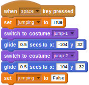

## जंपिंग

- धावकों को कूदना होता है। आपको इस भाग के लिए कुछ और पोशाकों की आवश्यकता होगी, इसलिए धावक निर्देशिका में देखें और अपने धावक के लिए `कूद-1` और `कूद-2` पोशाकें आयात करें।

- इस भाग के लिए आपको एक नए वेरिएबल की आवश्यकता होगी जिसका नाम `jumping` (कूदना) है। ऐसा इसलिए है क्योंकि अन्य स्क्रिप्ट को यह जानने की आवश्यकता होगी कि पात्र कब कूद रहा है। एक नया वेरिएबल बनाएँ और इसे `False` (गलत) पर सेट करें।
    
    <!--
when green flag clicked
set [last_key v] to [z]
set [speed v] to [0]
set [jumping v] to [False]
-->
    
    

- स्पेस बार दबाए जाने पर पात्र को कूदना चाहिए। इसमें पहली चीज़ होती है `jumping` (कूदना) वेरिएबल को `True` (सही) पर सेट करना, इसके बाद पोशाक को `jump-1` (कूदना-1) पर सेट किया जा सकता है और पात्र ऊपर की ओर ग्लाइड कर सकता है। इसके बाद, पोशाक को `jump-2` (कूद-2) में बदला जा सकता है और पात्र फिर से नीचे ग्लाइड कर सकता है। अंत में, `jumping` (कूदना) वेरिएबल को यह दर्शाने के लिए `False` (गलत) पर वापस किया जा सकता है कि कूदना एनिमेशन समाप्त हो गया है।
    
    <!--
when [space v]key pressed
set [jumping v] to [True]
switch to costume [jump-1 v]
glide [0.5] secs to x: [-104] y [32]
switch to costume [jump-2 v]
glide [0.5] secs to x: [-104] y [-32]
set [jumping v] to [False]
-->
    
    

- अपनी स्क्रिप्ट का परीक्षण करें; आपको यह देखकरआश्चर्य हो सकता है कि पात्र की पोशाक में बदलाव नहीं होता है। ऐसा इसलिए है क्योंकि आपके द्वारा पहले सेट अप किया गया चलने का चक्र अभी भी काम कर रहा है। जब पात्र कूद रहा हो तो आपको इस चलने के चक्र को रोकने की आवश्यकता होगी। ऐसा करने के लिए, आप यह जाँच करने के लिए एक `and` (और) सशर्त ऑपरेटर का उपयोग कर सकते हैं कि `speed > 0` और `jumping = False` दोनों चलने के चक्र के लिए काम करते हैं।
    
    <!--
when green flag clicked
forever
if <<(speed) > [0]>and<(jumping) = [False]>>
switch to costume [run-1 v]
wait ([1]/(speed)) secs
switch to costume [run-2 v]
wait ([1]/(speed)) secs
switch to costume [run-3 v]
wait ([1]/(speed)) secs
switch to costume [run-4 v]
wait ([1]/(speed)) secs
-->
    
    

- अब चलाकर देखें और आपको दिखाई देना चाहिए कि स्पेस कुंजी दबाए जाने पर आपका पात्र कूदता है।
