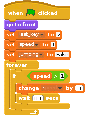

## गति को धीमा करना

- फिलहाल, आप `x` और `z` कुंजियों को जितना अधिक दबाते हैं, पात्र उतना अधिक तेज़ी से दौड़ता है। धावक को धीमा करने का कोई तरीका होना चाहिए, ताकि वह बहुत आसानी से न जीत पाए। यह आपकी प्रारंभिक स्क्रिप्ट पर किया जा सकता है जिसमें प्रारंभिक वेरिएबल सेट किए जाते हैं। आपको बस एक अंतरहित लूप जोड़ने की आवश्यकता है जो यह जाँच करेगा कि गति 1 से अधिक है, और फिर इसे हर सेकंड के कुछ 100वें हिस्से पर कम करेगा।
    
    <!--
when green flag clicked
set [last_key v] to [z]
set [speed v] to [0]
set [jumping v] to [False]
forever
if <(speed) > [-1]>
change [speed v] by [1]
wait [0.5] secs
-->
    
    