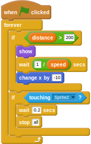

## Making an end to the game

- To finish off a completed game, you need to add in a finishing line. You can find one in the `assets/items` directory.
- Import this as a new sprite into your Scratch game, and approximately position it into the runner's lane.
- To start off, you need use a variable to control how far the hurdler has to run. Create a new variable and call it `distance`.
- The first script to be added to the finish line will set `distance` to `0` when the game begins, position the finish line to the far right of the screen, and hide it. Next, `distance` has to be increased by the `speed` of the runner every second.
    
    <!--
when green flag clicked
set [distance v] to [0]
go to x: [230] y: [-91]
hide
forever
set [distance v] to ((distance) + (speed))
wait [1] secs
-->
    
    

- Now that the finish line is ready to go, you can make it appear when the value of `distance` hits whatever value you desire (200 in the example below). It can then begin to move across the screen towards the hurdler. When the hurdler touches the finish line, all the game scripts should end.
    
    <!--
when green flag clicked
forever
if <(distance) > [200]>
show
wait ([1]/(speed)) secs
change x by [-10]
end
if <touching [Sprite2 v]?>
wait [0.2] secs
stop [all]
-->
    
    