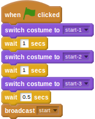

## Setting up the start

There are three graphics in the `runner` directory that you have not yet used. These are called `start-1`, `start-2`, and `start-3`. You can use these at the beginning of the game, to start the player off.

- Click on the hurdler sprite and then *Costumes*.
- Now import the three *starting* costumes for the hurdler.
- Click back on the *Scripts* tab.
- Now you can add in a new script to start the game. When the `green flag` is clicked, the starting costumes can be animated, before the script `broadcasts` start to indicate the game can begin.
    
    <!--
when green flag clicked
switch costume to [start-1 v]
wait [1] secs
switch costume to [start-2 v]
wait [1] secs
switch costume to [start-3 v]
wait [0.5] secs
broadcast [start v]
-->
    
    

- Now you need to edit the main animation loop so that it starts on the broadcast, rather than on the green flag being clicked.
    
    <!--
when I receive [start v]
forever
if <<(speed) > [0]>and<(jumping) = [False]>>
switch to costume [run-1 v]
wait ([1]/(speed)) secs
switch to costume [run-2 v]
wait ([1]/(speed)) secs
switch to costume [run-3 v]
wait ([1]/(speed)) secs
switch to costume [run-4 v]
wait ([1]/(speed)) secs
-->

