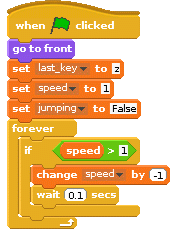
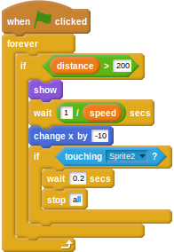

# The Scratch Olympics Hurdler

In this activity you will make a hurdles game using Scratch, where the speed of the runner is controlled by how fast you can hit the `x` and `z` keys, and perfect timing is required to jump over the hurdles at exactly the right time.

## Getting hold of the sprites

- Download this [zip file](images/assets.zip) to your home directory and unzip its contents.
- Have a look inside the directory; you should see 4 directories called `background`, `items`, `misc`, `runner`, and `turtle`.

## Setting up the assets


1. Open Scratch by clicking on `Menu` > `Programming` > `Scratch`.
1. Now, click on the `background` icon and import the new background from the `assets` directory. You can then delete the old background.
1. Click on the icon to import a new sprite and then choose the `run-1` image. Next, import `run-2`, `run-3`, and `run-4` as additional costumes. You can then delete the old cat sprite.

## Capturing the key mashing

1. The first step is to capture the `x` and `z` key presses, and use the speed at which the player is pushing the keys to control the size of a variable. To do this you'll need a variable that stores the last known key press. Create a variable called `last_key` and set it to `z` when the green flag is clicked.

	

1. For the next script you'll need a new variable called `speed`, so go ahead and create it now. It can be set to `0` when the game begins.

    <!--
	``` scratch
	when green flag clicked
	set [last_key v] to [z]
	set [speed v] to [0]
	```
    -->
	
	

1. When the `x` key is pressed, if the `last_key` is equal to `z`, then the `speed` variable can be increased and the `last_key` can be set to `x`. This will ensure that the player can't cheat and keep hitting the `x` key to make the speed increase.

	

1. The same can be done for the `z` key. In combination, these two scripts force the player to hit the keys _alternately_ in order to increase the speed variable.

	

1. Now test your script. Click the green flag, then repeatedly press the `x` and `z` keys and watch the speed variable increase.

## Animating the hurdler

1. At the moment, the hurdler has 4 costumes as part of what's called a _walk cycle_ (or run cycle in this case). When these costumes are switched, the character appears to run on the spot. The time delay between costume switches should depend on the `speed` variable. The higher the `speed`, the quicker the costume change should be and therefore the smaller the delay. You can get this effect by dividing `1` by the `speed` variable to calculate a delay.

	<!--
	``` scratch
	when green flag clicked
	forever
	switch costume to [run-1 v]
	wait ([1]/(speed)) secs
	switch costume to [run-2 v]
	wait ([1]/(speed)) secs
	switch costume to [run-3 v]
	wait ([1]/(speed)) secs
	switch costume to [run-4 v]
	wait ([1]/(speed)) secs
	```
	-->
	
	

1. If you run this script as it is, you'll get an error, because `speed` starts off with a value of `0`. This means the computer is trying to calculate `1 / 0`, which it can't do. It's a very common error that programmers make in their code. To fix this, you can use a conditional to make sure that the calculation only occurs when `speed` is larger than `0`.

	<!--
	``` scratch
	when green flag clicked
	forever
	if <(speed) > [0]>
	switch to costume [run-1 v]
	wait ([1]/(speed)) secs
	switch to costume [run-2 v]
	wait ([1]/(speed)) secs
	switch to costume [run-3 v]
	wait ([1]/(speed)) secs
	switch to costume [run-4 v]
	wait ([1]/(speed)) secs
	```
	-->
	
	

1. Now you should be able to test your script and watch the hurdler running on the spot as you press the `x` and `z` keys.

## Jumping

1. Hurdlers need to jump. You'll need a few more costumes for this part, so look in the runner directory and import the `jump-1` and `jump-2` costumes for your hurdler.

1. You'll need a new variable for this part called `jumping`. This is because other scripts will need to know when the character is jumping. Create the new variable and set it to `False`.

	<!--
	``` scratch
	when green flag clicked
	set [last_key v] to [z]
	set [speed v] to [0]
	set [jumping v] to [False]
	```
	-->
	
	
	
1. The character should jump when the space bar is pressed. The first thing that happens is the `jumping` variable should be set to `True`, then the costume can be changed to `jump-1` and the character can glide upwards. Next, the costume can be changed to `jump-2` and the character can glide back down again. Finally, the `jumping` variable can be returned to `False` to indicate that the jumping animation has finished.

	<!--
	``` scratch
	when [space v]key pressed
	set [jumping v] to [True]
	switch to costume [jump-1 v]
	glide [0.5] secs to x: [-104] y [32]
	switch to costume [jump-2 v]
	glide [0.5] secs to x: [-104] y [-32]
	set [jumping v] to [False]
	```
	-->
	
	
	
1. Test your script; it might surprise you to see that the character's costume doesn't change. This is because the walk cycle you set up previously is still working. You'll need to stop this walk cycle when the character is jumping. To do this, you can use an `and` conditional operator to check that both `speed > 0` and `jumping = False` for the walk cycle to work.

	<!--
	``` scratch
	when green flag clicked
	forever
	if <<(speed) > [0]>and<(jumping) = [False]>>
	switch to costume [run-1 v]
	wait ([1]/(speed)) secs
	switch to costume [run-2 v]
	wait ([1]/(speed)) secs
	switch to costume [run-3 v]
	wait ([1]/(speed)) secs
	switch to costume [run-4 v]
	wait ([1]/(speed)) secs
	```
	-->
	
	
	
1. Now have a go and you should find your character jumps when the space key is pressed.

## Slowing down

1. At the moment, the more you press the `x` and `z` keys, the faster the character runs. There needs to be a way of slowing the hurdler down, so she doesn't win too easily. This can be done on your initial script that sets the starting variables. You just need to add an infinite loop that will check if the speed is greater than 1, and then lower it every few 100ths of a second.

	<!--
	``` scratch
	when green flag clicked
	set [last_key v] to [z]
	set [speed v] to [0]
	set [jumping v] to [False]
	forever
	if <(speed) > [1]>
	change [speed v] by [1]
	wait [0.5] secs
	```
	-->
	
	

## Adding in hurdles

For the final part of this worksheet, you can add in hurdles that the character will have to jump over.

1. Import the hurdle.png sprite from the `assets/items` directory.
1. This sprite needs to begin at the far right of the screen, then it should continually move left across the screen at a pace that's proportional to the speed of the character. When it hits the far left of the screen, it should instantly appear on the right again.

	<!--
	``` scratch
	when green flag clicked
	go to x: [230] y:[-77]
	forever
	if <(speed) > [1]>
	change x by [-10]
	wait <[1]/(speed)> secs
	if <(x position) < [-230]>
	go to x:[230] y:[-77]
	```
	-->
	
	

## Making the hurdles an obstacle

At the moment the runner can just plough straight through the hurdles. She needs to be slowed down if she doesn't jump.

1. Back on the hurdler sprite, add in a new `when green flag clicked` block.
1. This next part is a little complicated. The runner should be slowed down if she:
  1. Isn't jumping
  1. Has an x position just before the hurdle
  1. Has an x position just after the hurdle
1. This can be achieved using two `and` logical operators, checking if:
  1. `jumping = False`
  1. `x position > x position of hurdle - 5`
  1. `x position < x position of hurdle + 5`
1. If all those conditions are met, then she must have hit the hurdle and her speed can be dropped.

	<!--
	``` scratch
	when green flag clicked
	forever
	if <<(jumping)=[False]>and<<(x position) > (([x position v] of [Sprite3 v])- [5])> and <(x position) < (([x position v] of [Sprite3 v]) + [5])>>>
	set [speed V] to [2]
	```
	-->

	

## Making an end to the game

1. To finish off a completed game, you need to add in a finishing line. You can find one in the `assets/items` directory.
1. Import this as a new sprite into your Scratch game, and approximately position it into the runner's lane.
1. To start off, you need use a variable to control how far the hurdler has to run. Create a new variable and call it `distance`.
1. The first script to be added to the finish line will set `distance` to `0` when the game begins, position the finish line to the far right of the screen, and hide it. Next, `distance` has to be increased by the `speed` of the runner every second.

	<!--
	``` scratch
	when green flag clicked
	set [distance v] to [0]
	go to x: [230] y: [-91]
	hide
	forever
	set [distance v] to ((distance) + (speed))
	wait [1] secs
	```
	-->

	

1. Now that the finish line is ready to go, you can make it appear when the value of `distance` hits whatever value you desire (200 in the example below). It can then begin to move across the screen towards the hurdler. When the hurdler touches the finish line, all the game scripts should end.

	<!--
	``` scratch
	when green flag clicked
	forever
	if <(distance) > [200]>
	show
	wait ([1]/(speed)) secs
	change x by [-10]
	end
	if <touching [Sprite2 v]?>
	wait [0.2] secs
	stop [all]
	```
	-->
	
	
	
## What next?

- Have a go at playing your game, or let one of your friends try.
- Now move on to [worksheet2](worksheet2.md) to see how you can add some extra features to your game to make it a little more interesting and fun.
